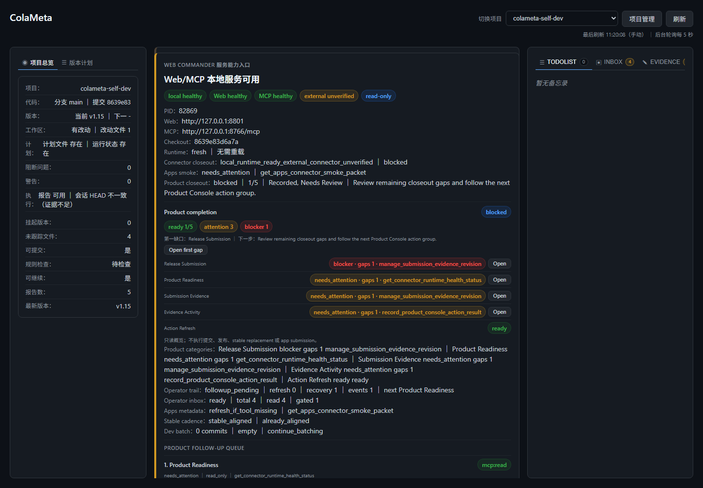
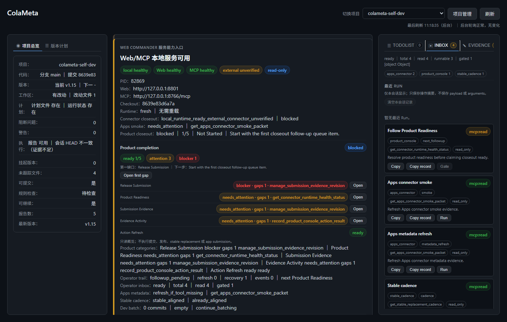
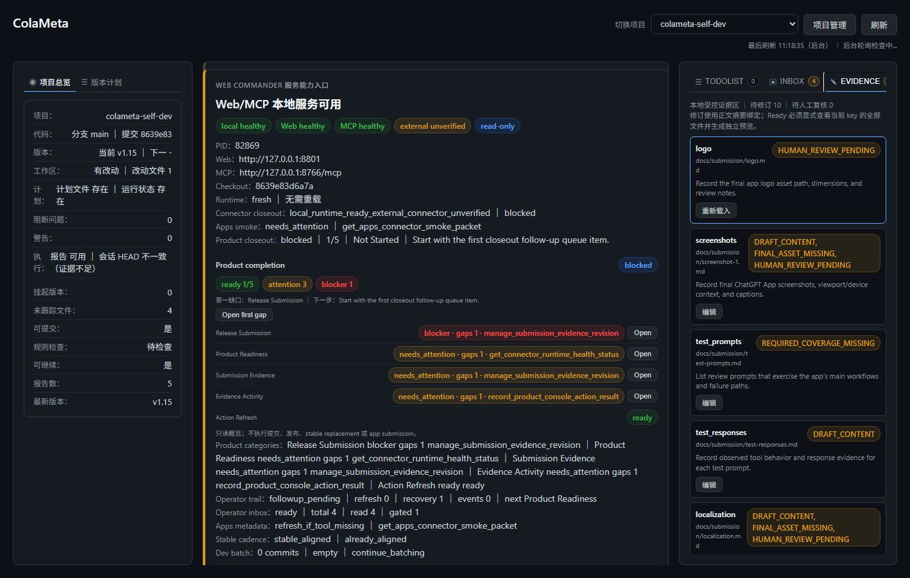
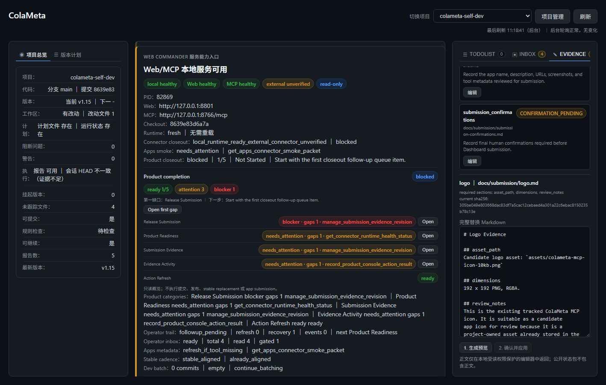
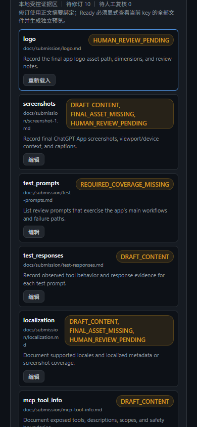
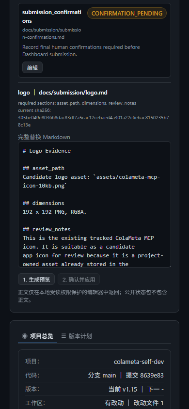

# Product Experience Audit — 2026-07-18

## Audit scope

Combined UX and screenshot-based accessibility review of the stable ColaMeta Web
Console release path at commit
`8639e83d6a7a572e1db1be26267aef7737313643`.

User goal: verify service health, find the next productization action, inspect
release evidence, and enter the controlled evidence editor without submitting or
publishing anything.

Capture viewports:

- Desktop: 1440 x 1000 and 1418 x 902.
- Narrow/mobile emulation: 390 x 844.
- Browser: a new temporary Chrome profile with no saved login state.

## Overall verdict

Conditional pass for a controlled public Beta workflow. The desktop release path
is usable and the preview/apply boundary is clear. Before a broader launch, the
product should clarify the difference between locally observed connector status
and externally proven Apps connector status. The narrow layout remains usable,
but reaching the release evidence editor requires a long vertical traversal.

## Flow steps

### 1. Project overview — needs attention

The service, Web, MCP, checkout, and runtime freshness signals are prominent and
easy to scan. Stable alignment is visible. The same screen still labels the
external connector `unverified` after the real Apps connector smoke succeeded and
its result was recorded. This is conservative, but the wording looks like a
contradiction rather than a provenance boundary.

### 2. Operator Inbox — healthy

The inbox separates runnable read actions from gated actions, names the required
scope, and exposes copy/run controls without hiding the permission boundary.
The density is high, but the next action is understandable.

### 3. Release evidence list — healthy

Each evidence item shows its file, status reasons, short purpose, and edit entry.
The status vocabulary is consistent, and the selected card has a visible focus
outline.

### 4. Evidence editor — healthy

The editor binds the evidence key and path, shows the current digest, lists the
required sections, and separates `1. generate preview` from `2. confirm and
apply`. The apply control remains disabled until a preview exists.

### 5. Narrow release path — needs attention

Cards reflow without horizontal clipping and controls remain legible. However,
the center activity panel appears before the release evidence panel, making the
primary release task expensive to reach on a narrow viewport. Long identifiers
and mixed Chinese/English copy also increase scanning effort.

## Strengths

- Health, version provenance, read-only state, and permission gates are visible.
- Tabs expose roles, selected state, labels, and arrow-key handlers in the current
  rendered DOM.
- Destructive or commit-scoped work is separated from read actions.
- Evidence editing is digest-bound and preview-first.
- Desktop and narrow screenshots rendered without blank, loading, or error states.

## UX risks

1. **Status provenance ambiguity:** local `external unverified` and externally
   proven connector readiness appear as one product state. Label the source and
   observation time, or show the recorded external smoke as a separate verified
   signal.
2. **Release-path depth on narrow screens:** evidence content appears after a long
   activity panel. Prioritize the active right-panel task or provide a compact
   jump navigation on narrow viewports.
3. **Information density:** the overview repeats several machine-oriented status
   strings. A short human summary with expandable technical details would improve
   first-read comprehension.

## Accessibility risks and evidence limits

- Visible focus exists on the selected evidence card, and tab controls expose
  labels and selected state.
- Screenshots cannot prove full keyboard order, screen-reader announcements,
  contrast ratios, zoom behavior, or error-state recovery.
- Several small metadata lines and compact controls may be difficult at high zoom;
  automated contrast and keyboard testing is still required before claiming WCAG
  conformance.

## Acceptance boundary

This audit did not submit evidence, mark evidence ready, publish the app, replace
the stable service, or claim full accessibility conformance. It records a
conditional product-experience pass and the remaining UX risks for submission
review.
